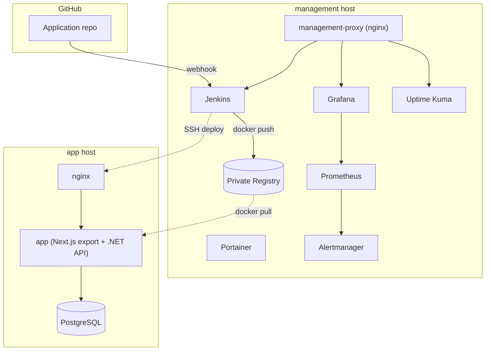
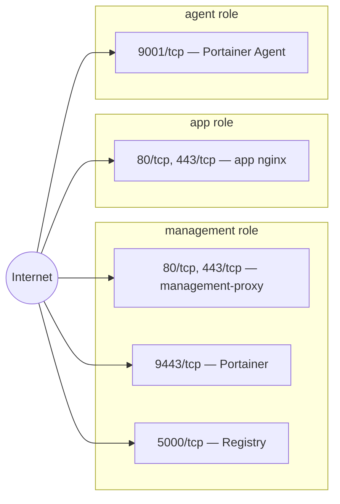
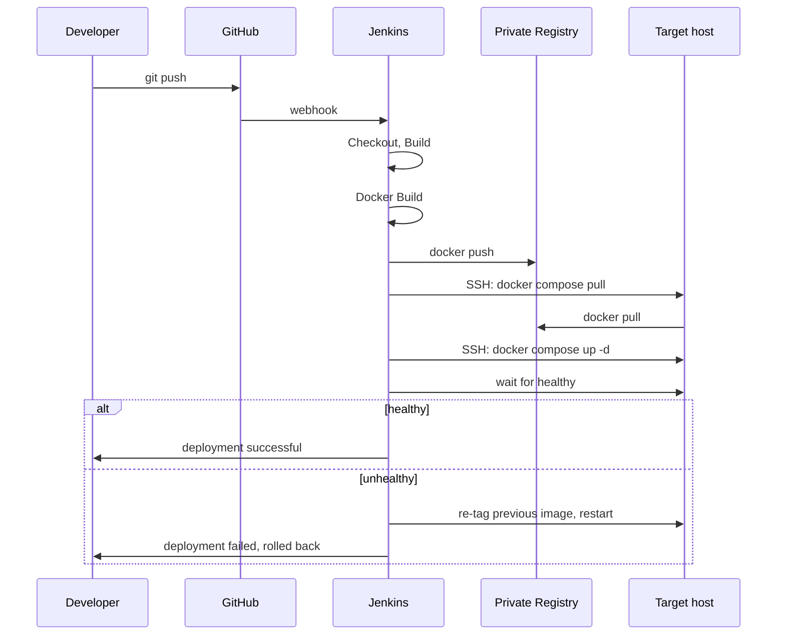

# Architecture

## Overview

Two host roles carry the whole system (a third, `agent`, exists only for future Portainer-managed nodes with no services of their own — see [docs/roadmap.md](roadmap.md)'s Deployment Journey):

- **`management`** — Jenkins (CI/CD), Portainer (Docker management), a private Docker Registry, and the observability stack (Prometheus, Alertmanager, Grafana, Uptime Kuma), all fronted by a single shared reverse proxy.
- **`app`** — the actual application stack: Nginx → `app` (a single container — Next.js static export served by the .NET API's own process) → PostgreSQL.

The two communicate through exactly one channel by design: the `app` host pulls images that Jenkins (on `management`) built and pushed to the Registry. Nothing else crosses the host boundary except, optionally, Prometheus scraping the `app` host's metrics exporters (see [docker/monitoring-agent/README.md](../docker/monitoring-agent/README.md) — off by default, a documented opt-in).

## Component diagram

## Network topology (externally reachable ports)

Matches `scripts/harden-host.sh`'s `role_ports()` exactly — this diagram and that function should never drift apart.

Deliberately absent: Node Exporter (9100) and cAdvisor (8080), on every role. Both bind to `127.0.0.1` only and are never in the externally-reachable set — see [docker/monitoring-agent/README.md](../docker/monitoring-agent/README.md) for why and how the opt-in works.

## CI/CD flow

Visualizes [vars/standardDeployPipeline.groovy](../vars/standardDeployPipeline.groovy)'s stage order — this is the same flow whether it's Jenkins running it or the manual fallback (`scripts/deploy.sh`, see [docs/deployment.md](deployment.md)) doing the equivalent by hand.

## Further reading

- [docs/deployment.md](deployment.md) — the deploy flow and role vocabulary in prose.
- [docs/platforms/](platforms/) — how each host actually gets provisioned, per cloud provider.
- [docs/recovery.md](recovery.md) — what happens when a host in this diagram is lost.
- [docs/runbooks.md](runbooks.md) — what to do when one of the alerts in the observability stack fires.
